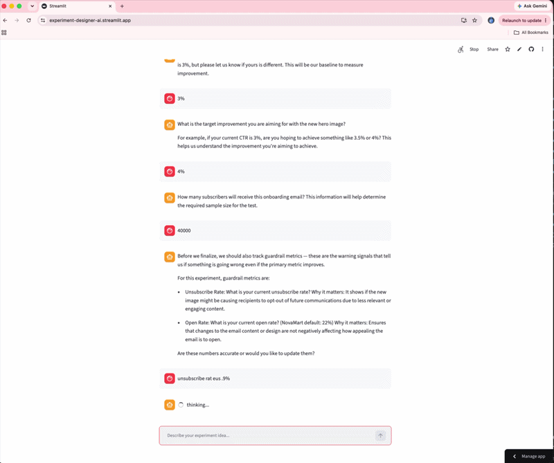

# 🧪 Experiment Designer AI

> Designing good experiments shouldn't require waiting for a data scientist.

Experiment Designer AI is an AI-powered assistant that helps Product Managers, Growth teams, and Marketers design statistically rigorous A/B tests and holdout experiments through a guided conversation.

Instead of generating a generic template, the agent asks follow-up questions, challenges ambiguous hypotheses, performs statistical calculations, and produces a complete experiment design in business language.

---

## Why I Built This

After spending 10+ years designing experiments across growth and marketing teams, I noticed the same pattern.

Coming up with an experiment idea is usually easy.

Designing a good experiment is not.

Questions like:

- Is this hypothesis measurable?
- Should this be an A/B test or a holdout?
- How much traffic do I need?
- How long should the experiment run?
- What should I measure?
- What happens if we hold users out?

almost always end up with a data scientist.

I wanted to explore whether an AI agent could guide teams through that process while applying experimentation best practices.

---

## Demo



---

## What the Agent Does

The agent guides users through the complete experiment design process.

### 1. Understand the Business Problem

- Identifies the business objective
- Clarifies the experiment idea
- Determines the experiment type

---

### 2. Refine the Hypothesis

Generates:

- Problem Statement
- Null Hypothesis
- Alternative Hypothesis

while asking follow-up questions whenever assumptions are unclear.

---

### 3. Design the Experiment

Creates recommendations for:

- Treatment & Control groups
- Randomization strategy
- Eligibility criteria
- Success metrics
- Guardrail metrics

---

### 4. Perform Statistical Calculations

Calculates:

- Sample Size
- Minimum Detectable Effect (MDE)
- Statistical Power
- Confidence Level
- Estimated Experiment Duration

using deterministic Python calculations.

---

### 5. Evaluate Business Trade-offs

For holdout experiments, the agent estimates:

- Opportunity Cost
- Revenue at Risk
- Expected Learning Value

to help teams balance business impact with experimentation rigor.

---

# Example Output

The final output includes:

- Business Problem
- Experiment Objective
- Null & Alternative Hypothesis
- Experiment Design
- Treatment & Control Setup
- Success Metrics
- Guardrail Metrics
- Sample Size
- Experiment Duration
- Opportunity Cost
- Recommendations & Risks

---

# Architecture

```
             User
              │
              ▼
        Streamlit UI
              │
              ▼
      LangChain Agent
              │
     ┌────────┼─────────┐
     │        │         │
     ▼        ▼         ▼

Experiment   Statistical   Business
Reasoning    Calculations  Logic

     │
     ▼

Experiment Design
```

---

# Current Capabilities

✅ Product Experiments

✅ Marketing Experiments

✅ A/B Tests

✅ Holdout Experiments

✅ Hypothesis Generation

✅ Sample Size Calculation

✅ Experiment Duration Estimation

✅ Opportunity Cost Calculation

✅ Business-Friendly Explanations

---

# Design Decisions

### Conversational instead of Forms

Rather than asking users to complete a long questionnaire, the agent dynamically asks only the questions required for the current experiment.

---

### Deterministic Statistics

Statistical calculations are performed in Python rather than by the LLM to ensure reproducible and mathematically correct outputs.

The LLM is responsible for reasoning.

Python is responsible for computation.

---

### Business-first Outputs

The goal isn't to teach statistics.

The goal is to help Product Managers and Marketers make better experimentation decisions.

Outputs are therefore written in business language instead of statistical jargon wherever possible.

---

# Tech Stack

- **LangChain** – Agent orchestration
- **OpenAI GPT-4o** – Experiment reasoning & conversation
- **Streamlit** – User Interface
- **Python** – Statistical calculations
- **SciPy** – Power analysis & sample size
- **Pandas** – Data processing

---

# Project Structure

```
experiment-agent/

├── app.py
├── tools/
│   ├── sample_size.py
│   ├── opportunity_cost.py
│   ├── hypothesis.py
│   └── experiment_detector.py
│
├── prompts/
│
├── utils/
│
├── requirements.txt
│
└── README.md
```

---

# Getting Started

```bash
git clone https://github.com/kavita-solves/experiment-agent.git

cd experiment-agent

python -m venv venv

source venv/bin/activate

pip install -r requirements.txt

cp .env.example .env

# Add your OpenAI API Key

streamlit run app.py
```

---

# Current Limitations

- Configured for a single business context
- User-level randomization only
- Opportunity cost currently supports marketing use cases
- Does not yet support Geo Experiments
- No experiment memory between sessions

---

# Roadmap

### Near Term

- PDF Export
- Experiment History
- Experiment Search
- Multi-company Context
- Geo Experiments

### Future

- Bayesian Experiment Design
- Sequential Testing
- Experiment Results Analyzer
- Knowledge Base of Previous Experiments
- Automatic Design Review
- AI Recommendations based on past learnings

---

# Lessons Learned

The hardest part wasn't building the agent.

It was deciding what should be deterministic and what should remain conversational.

Some tasks—such as hypothesis generation and follow-up questioning—benefit from an LLM.

Others—such as sample size calculation and statistical power—should remain deterministic.

Finding the right boundary between reasoning and computation was the most interesting design challenge in this project.

---

# Built By

**Kavita Malhotra**

Staff Data Scientist | Experimentation | Causal Inference | Growth Measurement

- 💼 LinkedIn: https://linkedin.com/in/kavita-malhotra-in
- 💻 GitHub: https://github.com/kavita-solves